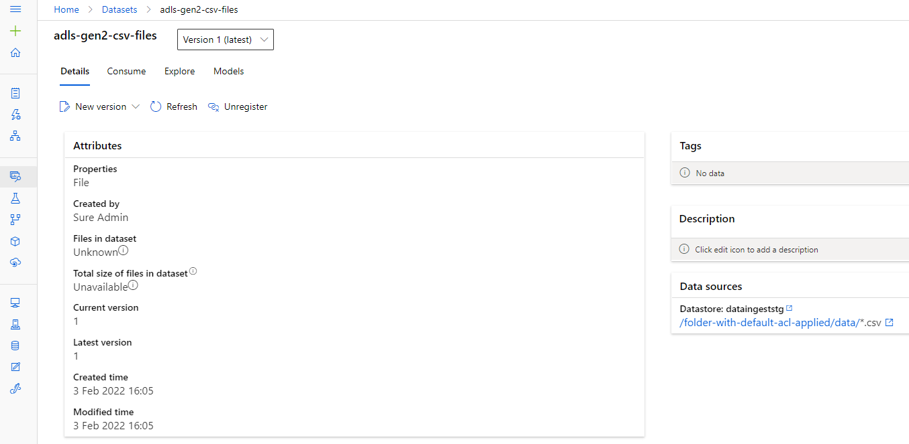
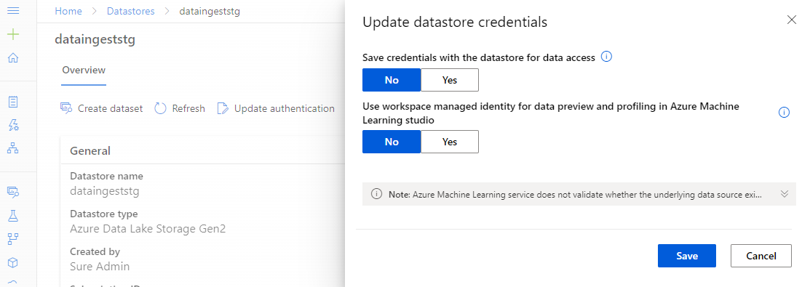
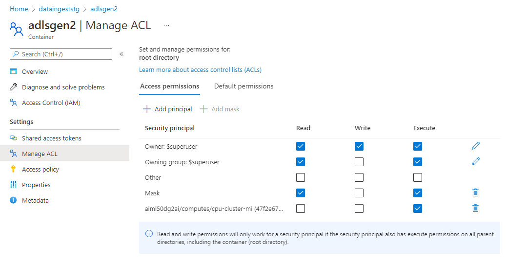
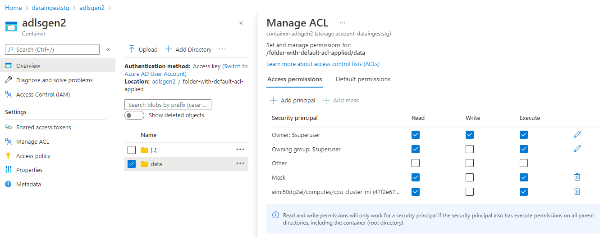

# Read data using the cluster's managed identity

Using the cli v2, create a job that reads data using the cluster's managed identity.

```bash
az ml job create -f job.yml --stream -w aiml50dg2ai -g mlops-demo-rg
```

The job is consuming a registered dataset that reads all csv files from a DataLake Gen 2.


> Note that the managed identity of the workspace doesn't have any permissions in the datastore and thus has `Unknown` files and size.



## Storage configuration

You only need to provide ACL access to the managed identity (NO RBAC).
Ensure the identity has `execute` permission in all folders within the container, starting from the root folder as seen below:



> You can also set in as a `Default permission` something that will place it in any child folder that you will be creating from that point on. It doesn't inherit to existing folders.

> Note that the best practice is to use security groups instead of assigning each identity ACL permissions.

Ensure you have `read` permission at the folder where you want to list the files as seen bellow:

