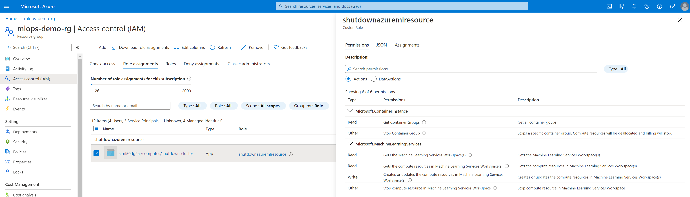

# Auto shutdown AzureML resources

Have you made ACI deployments from AutoML or spined up compute instances that you forgot to shut down? Did you scale up your cluster to run those jobs faster and forgot to scale it down to min_node=0?

This pipeline runs automatically on a daily schedule and:
- shuts down all Azure Container Instances located in the same resource group as my AzureML workspace
- stops all compute instances running in the workspace
- scales clusters to 0 min nodes

You need to provide the needed permissions to the managed identity of the compute cluster that is executing this pipeline to be able to perform all these actions.

Start from the [jupiter notebooks that creates the pipeline](./ScheduleAutoShutdown.ipynb)
