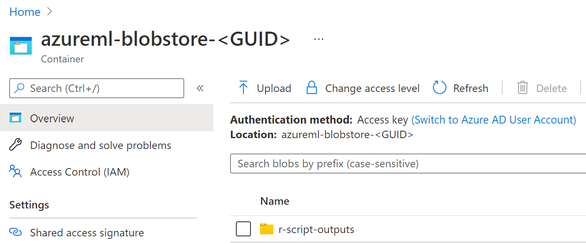

# Batch parallel inference invoking an R script

Imagine that you have a number of files you want to batch process with an R script. These can be images (like in this example) or even [RData](https://bookdown.org/ndphillips/YaRrr/rdata-files.html) files that contain tabular datasets.

Open the [notebook](./ParallelRunInR.ipynb) to create a pipeline that executes in parallel an R script, once for each file in the FileDataset you pass as a parameter.

The idea is that you create a pipeline using python with a parallel step. That step is invoking a python script that implements the parallel step contract (see `./scripts/batch_wrapper.py` file for implementation details). That file is invoking Rscript to execute the `./scripts/process_file.r`.

The results of the R script file are stored in the `r-script-outputs` folder on the root of the default store as seen in the following image:

A potential alternative would have been to use the [RScript step](https://docs.microsoft.com/en-us/python/api/azureml-pipeline-steps/azureml.pipeline.steps.rscriptstep?view=azure-ml-py) directly without a pipeline. In that case you would submit on RScript per file you wanted to process.

## Inspiration

The idea of this demo is to show how to combine python to create a [ParallelRunStep](https://docs.microsoft.com/en-us/python/api/azureml-pipeline-steps/azureml.pipeline.steps.parallelrunstep?view=azure-ml-py) to invoke the R script [passing the files to process via arguments](https://www.r-bloggers.com/2015/09/passing-arguments-to-an-r-script-from-command-lines/). We will base the code on the notebook https://aka.ms/batch-inference-notebooks.

For the python wrapping have a look on https://github.com/microsoft/MLOpsPython/tree/master/diabetes_regression/training/R.

## References

- Parallel config: https://docs.microsoft.com/en-us/python/api/azureml-contrib-pipeline-steps/azureml.contrib.pipeline.steps.parallelrunconfig?view=azure-ml-py
- Sample batch sample: https://github.com/Azure/MachineLearningNotebooks/blob/master/how-to-use-azureml/machine-learning-pipelines/parallel-run/tabular-dataset-inference-iris.ipynb
