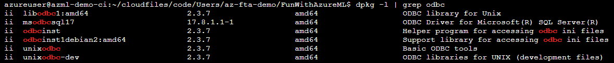

# Interesting scripts on AzureML

Most of them are not tested but still interesting enough to document.


## ONNX model from automl

```
from azureml.core import Run
from azureml.pipeline.core import PipelineRun
from azureml.train.automl.run import AutoMLRun
run = Run.get_context()
pipeline_run = PipelineRun(run.experiment, run.parent.id)
automl_run = pipeline_run.find_step_run("name-of-automl-step")[0]
automl_run = AutoMLRun(automl_run.experiment, automl_run.id)
best_run, model = automl_run.get_output(return_onnx_model=True)
```

## SQL ODBC and pyodbc driver on compute instance

Check that odbc driver is installed and then install through conda and upgrade through pip.

``` bash
dpkg -l | grep odbc
conda install pyodbc
pip install --upgrade pyodbc
```

