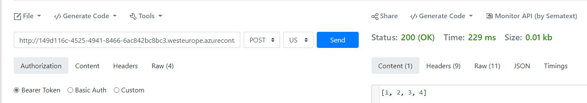

# Minimal ACI deployment

Very minimal ACI deployment that doesn't use any model. The `score.py` returns the same responses. In terminal run `python deploy_aci.py` to deploy the ACI instance.

To test with curl (replace the IP with the one pointing to your ACI):

```
curl -X POST -H "Content-Type: application/json" -d "{}" http://10.2.255.4/score
```

Or an [online tool](https://reqbin.com/):
