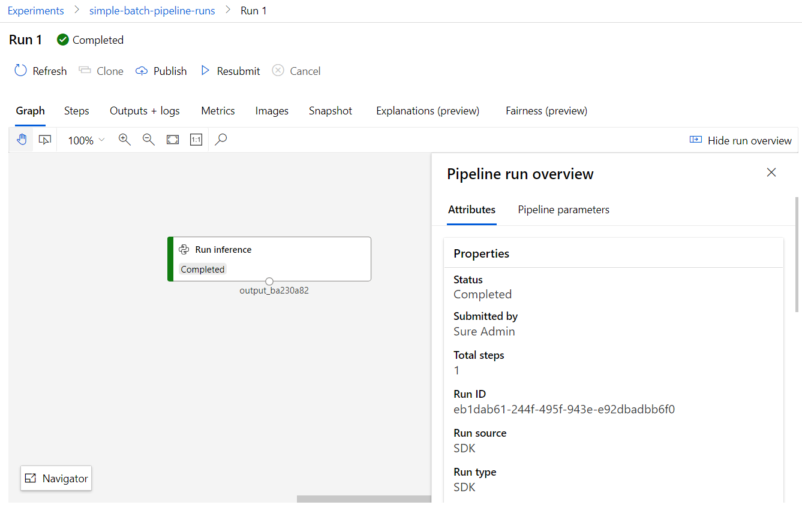
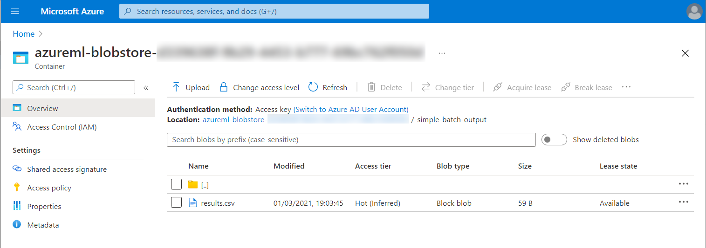

# Simple batch inference that stores in blob

A sample pipeline that uses a [model](SimpleModel.py) to make inferences on a [small dataset](sampledata.csv). The pipeline is a single step one:

The dataset that includes the inferences in column `outputs` is stored within the default datastore of the AzureML workspace in the path `simple-batch-output/results.csv`. 

Use [Requirements.ipynb](./Requirements.ipynb) to create a model, register it in the workspace and upload and register the inference dataset.

Use [SimpleBatchScoring.ipynb](./SimpleBatchScoring.ipynb) to create the inference script and the inference pipeline to score the dataset you registered.
