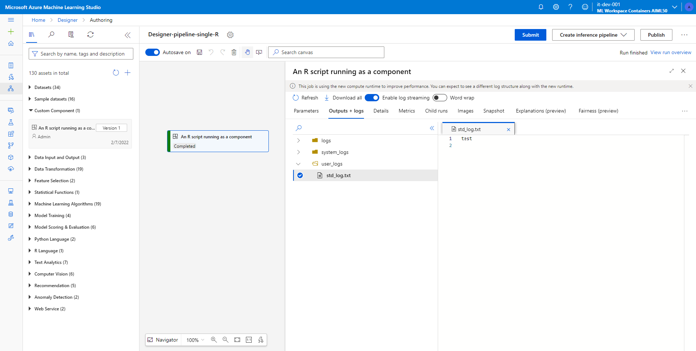

# Simple R component to expose in designer

This is a simple component to show how easy it is to componetize your existing R scripts.

You develop your R code as you are used to.

When done, you drop your R scripts in the `src` folder and you define all your code's CRAN packages in the [Dockerfile](./environment/Dockerfile) adding lines like the following:

```Docker
RUN R -e "install.packages('optparse', repos='https://cran.rstudio.com')"
```

You then register the component in AzureML using the following AzureML CLI-V2 command:

```bash
az ml component create -f component.yml
```

From there on, you can drag and drop it in the designer:


