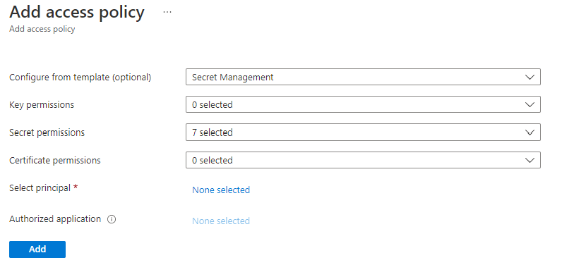
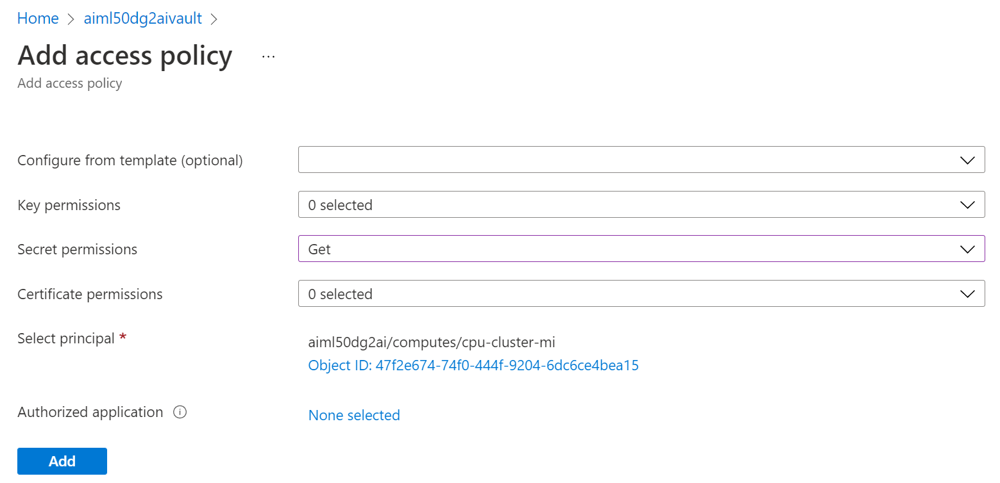
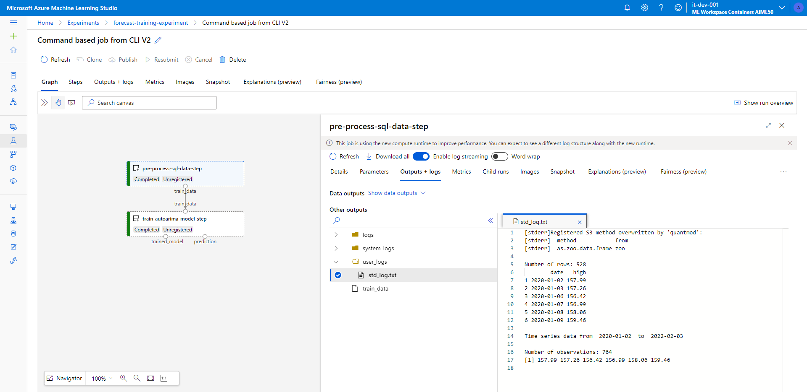
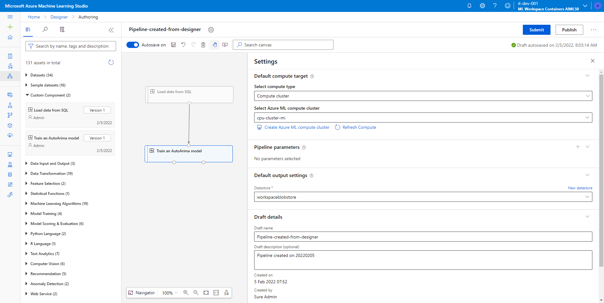
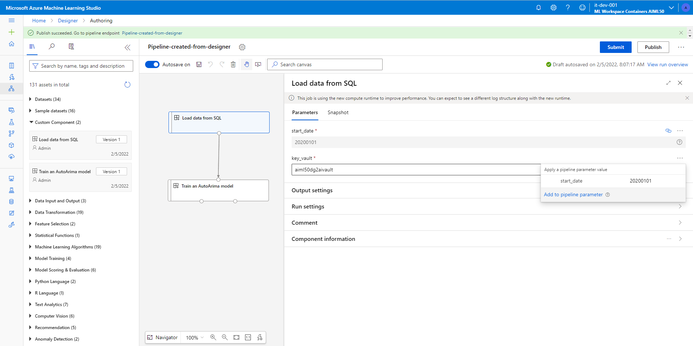
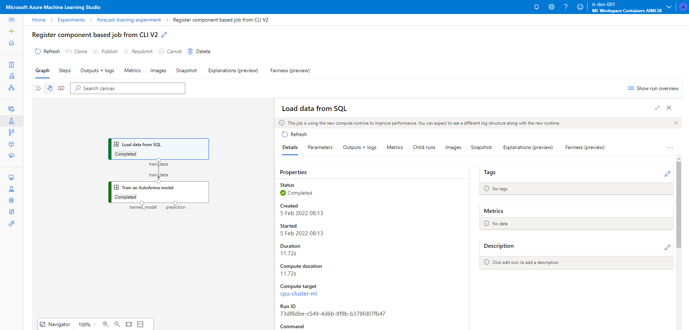
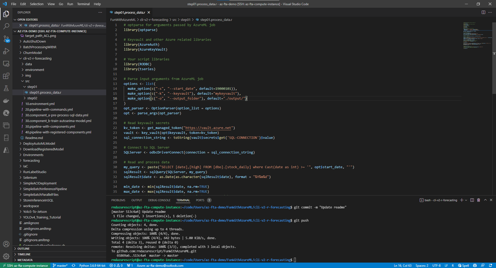

# Forecasting using R and AzureML cli v2

We are going to use the [daily US market data from stooq](https://www.mssqltips.com/sqlservertip/6963/download-stooq-historical-stock-price-volume-data-sql-server/).

The data are inserted in a `forecastdatabase` database which is hosted in an Azure SQL server, using the scripts in the [data folder](./data/). In this tutorial we use the `forecasting-app` sql user which is able to read the data from the database. In this sample the connection string is stored in a key vault and the code uses the compute cluster's managed identity to read that secret.

> It's advised to use Azure Active Directory based authentication to connect to the Azure SQL database, using [managed identity](https://docs.microsoft.com/azure/search/search-howto-managed-identities-sql).

## Configure your terminal

Setup [Azure CLI and the AzureML CLI V2](https://docs.microsoft.com/azure/machine-learning/how-to-configure-cli).

```bash
az login --use-device-code
az configure --defaults group=mlops-demo-rg workspace=aiml50dg2ai
```

> Note that we configure the default resource group and workspace for Azure CLI to avoid passing the `-g` and `-w` parameters in all our az commands

## Environment

This is the docker image that contains all the software dependencies for our code.

> We could have separate environments for each step of the pipeline. For simplicity we use just a single environment in this example.

For the modeling we will use a very simple ARIMA Model Using auto.arima() function from the forecast@8.16.
In the [Docker file](./environment/Dockerfile) we use the following line to install

```Docker
RUN R -e "devtools::install_version('forecast', version = '8.16', repos = 'http://cran.us.r-project.org')"
```

We also install SQL server support. With this support baked in the image you can use this article to see [how to make database queries with R](https://db.rstudio.com/getting-started/database-queries).

You could use the following notation in your pipeline and component yaml files to define the environment:

```yaml
environment:
  build:
    local_path: environment
```

Instead of doing that, we will register the environment in the AzureML workspace and reuse it:

```bash
az ml environment create -f 10.environment.yml
```

> Note that you can set the version by overriding yaml variable, appending `--set version="2022-02-01"`

### Debugging locally

If you want to debug the docker environment locally, you can build it using the following command:

```bash
docker build . -t local/r-env
```

And then mount the source files and run a `/bin/bash` to get inside the docker image and execute your scripts:

```bash
docker container run -it --entrypoint /bin/bash --mount type=bind,source=/git/FunWithAzureML/cli-v2-r-forecasting/src,target=/mnt local/r-env:latest
```

## Configure key vault

You will need to store the SQL server connection string in a key vault. Your [R code](./src/step01/step01.process_data.r) will login to your key vault using the cluster's managed identity and will read the `SQL-CONNECTION` secret.

To be able to set that secret, you will need to have the required permissions. You can use the `Secret Management` access policy seen bellow:
> Don't forget to hit `Save` to apply changes.



Then set the connection string that will be used by the R scripts.

```bash
az keyvault secret set --vault-name <vault_name> --name SQL-CONNECTION --value "Driver={ODBC Driver 17 for SQL Server};server=<sql_server_name>.database.windows.net;database=forecastdatabase;User Id=forecasting-app;Password=<forecasting-app-password>;" "Driver={ODBC Driver 17 for SQL Server};Server=tcp:<sql_server_name>.database.windows.net,1433;Database=forecastdatabase;Uid=forecasting-app;Pwd=<forecasting-app-password>;Encrypt=yes;TrustServerCertificate=no;Connection Timeout=30;"
```

> The connection string can be found in the Azure portal visiting the Azure SQL database

> Note: Normally you would have only the server, user and password in your key vault. The rest of the information could have been set as environment variables. For example the ODBC driver version.

> Note: Make sure you escape any $ character you may have in your password as `bash` will replace it. E.g. if you use `mypa$$` you should input it in the string as `mypa\$\$`.

To allow your code to read the secret, you need to provide `Get` secret permission to the cluster's managed identity that is going to run the pipeline:


## Run command based pipeline

Run the job using the following command:

```bash
az ml job create --file 20.pipeline-with-commands.yml --set display_name="Command based job from CLI V2" --web
```

The `--set display_name="Command based job from CLI V2"` is optional and sets the display name of the execution.
The `--web` is also an optional parameter. It opens a web browser and you should see the following execution:



Clicking on each step, will get you directly to the logs and you can navigate to each step's output clicking on the **Data outputs** section.

## Run component based pipeline

Instead of having command based steps, you can move the logic into isolated components.

```bash
az ml job create --file 30.pipeline-with-components.yml --web --set display_name="Component based job from CLI V2"
```

You can also register the components to be able to re-use them in the designer or your yaml pipelines:

```bash
az ml component create --file 30.component_a-pre-process-sql-data.yml
az ml component create --file 30.component_b-train-autoarima-model.yml
```

After you register the components, you can see them in the designer:



And you can expose component inputs as pipeline parameters with the usual way:



You can reuse the components as seen in the `40.pipeline-with-registered-components.yml` file. In contrast to the `30.pipeline-with-components.yml` file which needs the `30.component*.yml` files and the `src` folder, the `40.pipeline-with-registered-components.yml` file doesn't need any other file, since the components are already registered in the workspace.

```bash
az ml job create --file 40.pipeline-with-registered-components.yml --web --set display_name="Register component based job from CLI V2"
```



## Considerations

Here is a list of considerations before going to production:

- **Database connectivity**: How will you allow the compute instance to reach the SQL server? You will need to go with network isolation and private endpoints or work on the firewall rules.
- **SQL injection attacks in R**: Concatenating strings is a terrible practice in SQL. In this sample, someone can pass `'; Drop table [dbo].[stock_daily];--` as the `pipeline_train_start_date` parameter (if it was not explicitly typed as integer) and if the `forecasting-app` sql user had enough permissions, the table would have been dropped.

## Working from VS Code

This tutorial was created within Visual Studio Code which was attached to my AzureML compute instance. I can use features like [GitHub Autopilot](https://copilot.github.com/) to autocomplete your code, something that was incredibly useful compiling the R scripts (since I have moved to python for a long time now).

