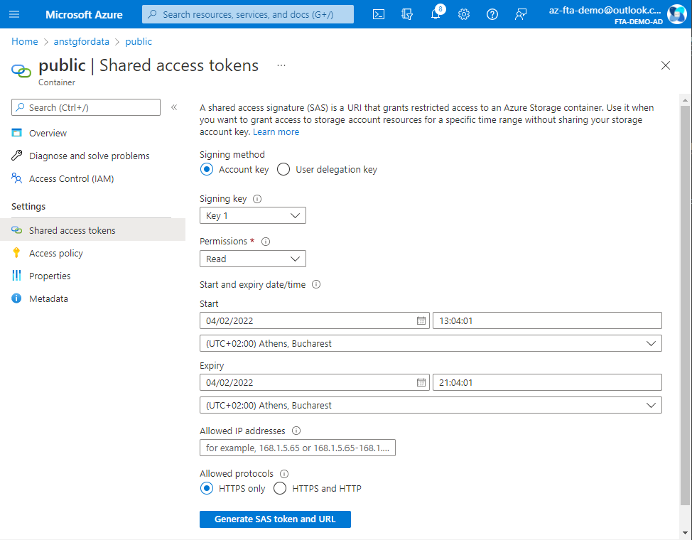

# Upload data from linux to Azure SQL

We will upload the [daily US market data from stooq](https://www.mssqltips.com/sqlservertip/6963/download-stooq-historical-stock-price-volume-data-sql-server/). The repository already has the `msft.us.txt` data which is the daily data for the Microsoft stock till 2022-02-03.

1. [Install sqlcmd](https://docs.microsoft.com/en-us/sql/linux/sql-server-linux-setup-tools?view=sql-server-ver15) (see install_sql_cmd.sh file)
1. Upload data into a blob accessible by the sql server (normally protected with at least SAS Access token).

   ```bash
   wget https://aka.ms/downloadazcopy-v10-linux
   tar -xvf downloadazcopy-v10-linux
   rm downloadazcopy-v10-linux
   mv azcopy_linux_amd64_10.13.0/azcopy ./
   rm -rf azcopy_linux_amd64_10.13.0
   azcopy copy './msft.us.txt' 'https://<storage_account_name>.blob.core.windows.net/public/msft.us.txt?<SAS token>'
   ```

   Where the `SAS token` can be generated from the portal
   
1. Execute script passing the location of the stock data

   ```bash
   sqlcmd -S <sql_server_name>.database.windows.net -d forecastdatabase -v StorageUrl='https://<storage_account_name>.blob.core.windows.net' FilePath='public/msft.us.txt' -i populate_data.sql -U forecasting-app -P '<forecasting-app-password>'
   ```

   > We assume that the `forecasting-app` has enough permissions to execute the SQL script. In our demos, we use the same user to also read the data from the R script. In reality we should have used a separate user to upload and another one that can only read data.

   > Note that in production scenarios you would need to read data from a non publicly accessible container. In that case you will need to pass credentials as seen in the [official documentation](https://docs.microsoft.com/sql/relational-databases/import-export/examples-of-bulk-access-to-data-in-azure-blob-storage?view=sql-server-ver15)
