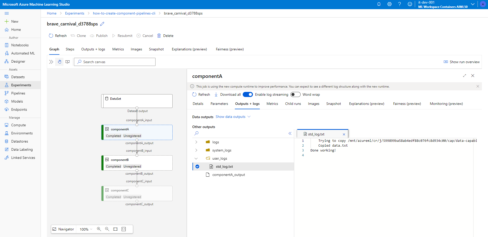

# Pipeline with components

A pipeline used in [this article](https://docs.microsoft.com/azure/machine-learning/how-to-create-component-pipelines-cli), to demonstrate inter-component input-output relationships.

To run the sample, setup [Azure CLI and the AzureML CLI V2](https://docs.microsoft.com/azure/machine-learning/how-to-configure-cli). Then use the `ml job create command`:

```bash
az login --use-device-code
az configure --defaults group=mlops-demo-rg workspace=aiml50dg2ai
az ml job create -f inputs-and-outputs.yml
```

All three components use the same code, for demo purposes. They copy files from the input path to the output path that are passed as arguments.


You should see the following execution within AzureML studio:



If you want to run on a different compute cluster (e.g. `cpu-cluster-mi` instead of `cpu-cluster`), use:

```bash
az ml job create -f inputs-and-outputs.yml --set compute=azureml:cpu-cluster-mi
```
