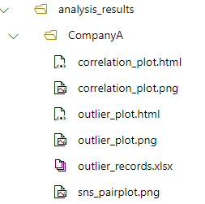
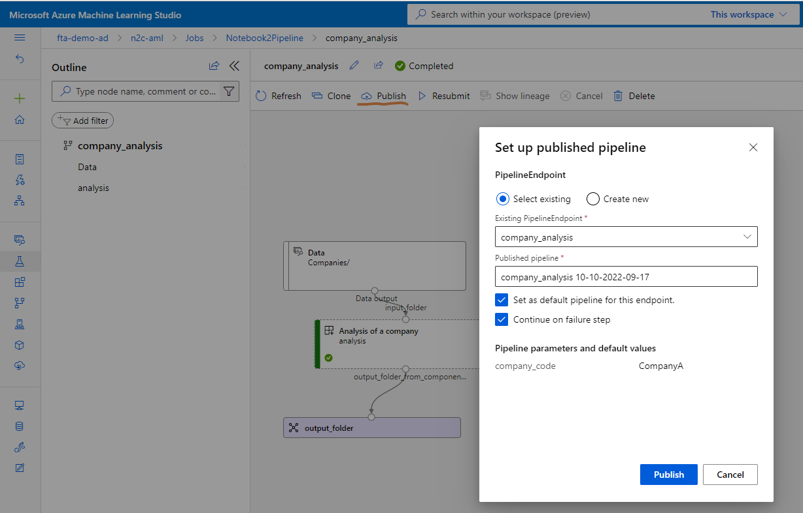

# Converting a notebook into a repeatable AzureML pipeline (cli v2)

This folder contains the sample code used in the following video:

[](https://youtu.be/4QPqbLf57iU)

> NOTE: Datastores moved under Data and do not exist on the root level menu anymore.

> NOTE: If you are planning to run this behind a v-net, you can build a docker image on your compute instance, push it to your ACR and then use that in your component using the following code:
> ```yaml
> environment:
>   image: <your-acr-name>.azurecr.io/customrepo/customimagename:v1
>   name:  analysis-environment
> ``` 
> See [the forecast online endpoint behind vnet video](https://github.com/rndazurescript/FunWithAzureML/tree/master/forecast-online-endpoint#deploying-with-network-isolation) to see how creating a docker image works.

## Curate the code

Let's assume that you start from [a notebook](./original_notebook.ipynb) that does an analysis reading [an Excel file](./CompanyA.xlsx).
The goal is to make this notebook generic, so that it can read the excel files from a folder structure like the following:

```bash
Companies
  CompanyA
    Records.xlsx
  CompanyB
    Records.xlsx
```

After [modifying the notebook code](./final_notebook.ipynb), you can export [a python script](./Code/analysis.py) which you can execute using the following command:

```bash
cd Code
python analysis.py --company-code CompanyA --input-folder ../Companies --output-folder ../analysis_results
```

The outputs of the analysis are stored in the `analysis_results` folder under a folder named `CompanyA`, as seen below:



## Create the pipeline

To create a pipeline, you need to create [an environment](./environment.yml) which contains all the [software dependencies](./DockerContext/requirements.txt) of your code. You register the environment using the following command:

```dotnetcli
az ml environment create -f environment.yml
```

> Note that in the video the file was with a capital E, e.g. Environment.yml

You can then execute a job using:

```dotnetcli
az ml job create -f company_analysis_pipeline.yml 
```

The job above will execute only once and then reuse the cached outputs if you execute it a second time. If you want to force the re-execution of the company analysis (e.g. if you have an Azure Data Factory pipeline that copies a new excel file over the previous one) you can move the command code [into a separate component](./companyAnalysisComponent.yml) use the `is_deterministic: false` attribute in the yaml file. Then you can execute a new job using the updated file:

```dotnetcli
az ml job create -f company_analysis_pipeline_with_component.yml 
```

You can publish a job as a pipeline through the UI:



## Additional topics addressed in video

You can install and run the linter and file formatter using the following code:

```dotnetcli
pip install black[jupyter] flake8 flake8_nb
black .
flake8 .
flake8_nb .
```

> See the [setup.cfg](./setup.cfg) file for configuration options.

Before using the `az` command for the first time, you will need to login and optionally set the active subscription (if you have more than one). Here are the commands shown in the video:

```dotnetcli
az --version
az login
az account show
az account list
az account set --subscription ab05...ab05
az account show
```

## References

You can read more:

- https://learn.microsoft.com/azure/machine-learning/how-to-create-component-pipelines-cli
- https://learn.microsoft.com/azure/machine-learning/tutorial-pipeline-python-sdk
- https://github.com/Azure/azureml-examples/tree/main/sdk/python/assets/environment
